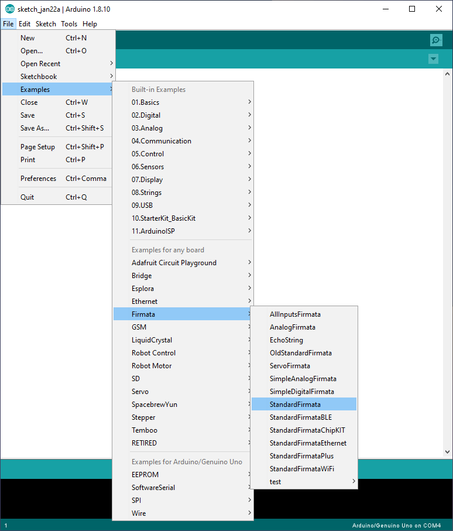

# Controller stepper motors A4988 using python
This construction of an automatic measuring station with a 3 axis scanner for ultrasonic examination of samples in transmission and reflection.


## Installation

This project is working with 
- `python 3.11.0`
- `pyFirmata` https://pypi.org/project/pyFirmata/
- `tkinter` https://docs.python.org/3/library/tkinter.html

### Clone project

```bash
  git clone https://link-to-project
```

### Go to the project directory

```bash
  cd my-project
```

### Run StandardFirmata on your Arduino board

First you have to configure your Arduino. This is really a quick step.
Plug your Arduino to your computer with the USB cable, launch the Arduino IDE, and upload the StandardFirmata sketch to your board.



Make sure your Arduino board is selected in “Tools” > “Port”.

(Check out this StandardFirmata tutorial if you want to know more about Firmata on Arduino.)

Now that the program is uploaded, you can remove the USB cable and disconnect your Arduino.


### Install dependencies

```bash
  pip install tk
```

```bash
  pip install pyFirmata
```

### Start the project execute `index.py`


## Authors

- [@ale4a](https://www.github.com/ale4a) Alejandro Alvarez


# https://runestone.academy/ns/books/published/thinkcspy/GUIandEventDrivenProgramming/03_widgets.html
# read about change env
# https://code.visualstudio.com/docs/python/environments